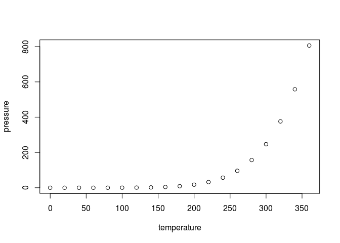

CodeBook
================
Author: José Antonio Cózar Ríos
Date: 20 Mars 2017

Project description
-------------------

Here a short description of the project. This is an R Markdown format used for publishing markdown documents to GitHub. When you click the **Knit** button all R code chunks are run and a markdown file (.md) suitable for publishing to GitHub is generated.

Study designed and data processing
----------------------------------

Here how is the processing of data

Raw data collection description
-------------------------------

Here a description of how the data was collected

-   step 1
-   step 2
-   step 3

Creating the tidy datafile
--------------------------

### Download data

Description on how to create the tidy data file

-   step 1
-   step 2
-   step 3

### Cleaning of data

Short description of how the script does. The README file contain more details. \* step 1 \* step 2 \* step 3

Description of the variable
---------------------------

-   dimension of data set
-   summary of data set
-   list of variables

### Variable 1

Short description

-   Class
-   Unique/levels of the variables
-   Unit of measurements
-   In case of text-names describe how entries was constructed
-   Notes

### Including Code

You can include R code in the document as follows:

``` r
summary(cars)
```

    ##      speed           dist       
    ##  Min.   : 4.0   Min.   :  2.00  
    ##  1st Qu.:12.0   1st Qu.: 26.00  
    ##  Median :15.0   Median : 36.00  
    ##  Mean   :15.4   Mean   : 42.98  
    ##  3rd Qu.:19.0   3rd Qu.: 56.00  
    ##  Max.   :25.0   Max.   :120.00

### Including Plots

You can also embed plots, for example:



Note that the `echo = FALSE` parameter was added to the code chunk to prevent printing of the R code that generated the plot.
